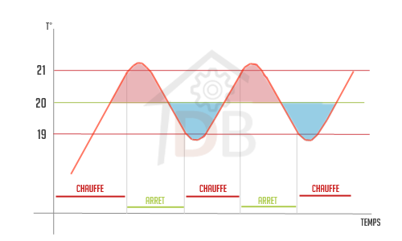
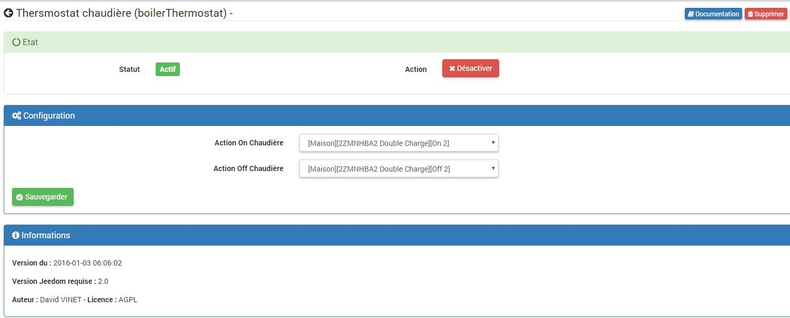
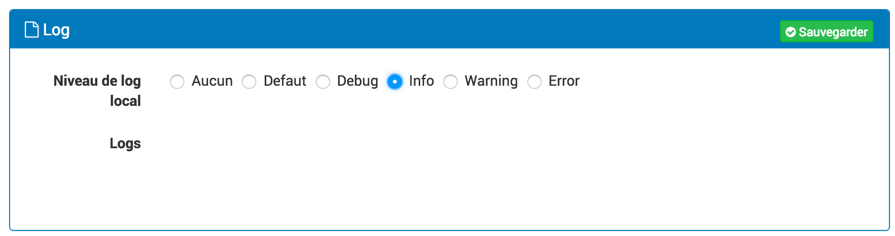
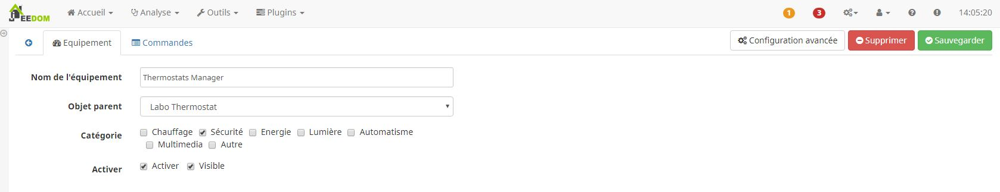
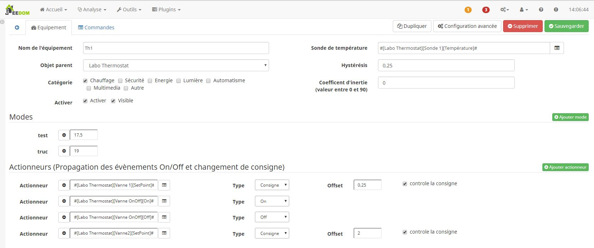

Description
===========

Ce plugin permet la gestion du chauffage centrale en multizone.

Introduction
============

Lorsque le thermostat d'une zone détecte que la température n'est pas 
suffisante, il active la chaudière.

Il est possible de générer deux types d'équipement :

-   Des thermostats : utilisés pour la gestion de la consigne et de la température
-   Un manager : utilisé pour des actions globales sur le chauffage (présence, On/Off global, ...)

Principe de régulation
----------------------

Les Thermostats fonctionnent en mode hystérésis avec une prise en compte 
de l'inertie de la pièce.
Voici un graphique présentant le fonctionnement d'un thermostat avec hystérésis :

Ce mode de régulation fonctionne mais a le désavantage de s'écarter de la 
consigne même au-delà du réglage de l'hystérésis.

> **Tip**
>
> En réglant la valeur d'inertie à 0% sur un thermostat, 
> c'est ce fonctionnement qui est obtenu.

Afin d'améliorer ce principe, un paramètre d'inertie est à définir sur
chaque thermostat en fonction de l'inertie de la pièce à chauffer.
Plus la pièce est lente à chauffer, plus la valeur à mettre est grande.

Cette inertie va être utilisée afin de déclencher le chauffage avant 
d'atteindre la température Consigne-Hystérésis, ceci va permettre de rester
au plus proche de la consigne cible et surtout de ne pas descendre sous la
température Consigne-Hystérésis.
De la même façon, ce paramètre va permettre d'arrêter le chauffage avant 
d'atteindre la température Consigne+Hystérésis, ceci va permettre de rester
au plus proche de la consigne cible et surtout de ne pas dépasser la température
Consigne+Hystérésis.
Voici un graphique présentant le fonctionnement d'un thermostat avec hystérésis
et prise en compte de l'inertie. Sur celui-ci la valeur d'inertie est environ de 70%.

> **Tip**
>
> Sur l'image ci-dessus l'hystérésis est très importante (1°C). 
> Dans la réalité, je préconise de mettre une hystérésis de 0,5°C maximum 
> et une inertie de 20% pour une petite pièce et de 60% pour de très 
> grandes pièces. Bien sur ces valeurs sont à adapter à 
> votre système de chauffage.

Configuration du plugin
=======================

Une fois le plugin activé, il faut définir les actions permettant de 
mettre la chaudière en route ou de l'éteindre :

> **Tip**
>
> Les actions disponibles dans la liste déroulante sont toutes les actions 
> de type "binaire" présente dans votre installation Jeedom, ce qui comprend 
> toutes les actions On/Off.

Log
---

Cette partie permet de choisir le niveau de log ainsi que d’en consulter
le contenu.

Sélectionner le niveau puis sauvegarder, le démon sera alors relancé
avec les instructions et traces sélectionnées.

Le niveau **Debug** ou **Info** peuvent être utiles pour comprendre
pourquoi le démon plante ou ne remonte pas une valeur.

> **Important**
>
> En mode **Debug** le démon est très verbeux, il est recommandé
> d’utiliser ce mode seulement si vous devez diagnostiquer un problème
> particulier. Il n’est pas recommandé de laisser tourner le démon en
> **Debug** en permanence, si on utilise une **SD-Card**. Une fois le
> debug terminé, il ne faut pas oublier de retourner sur un niveau moins
> élevé comme le niveau **Error** qui ne remonte que d’éventuelles
> erreurs.

Configuration des équipements
=============================

Paramétrage du "Manager"
------------------------

Lors de la création d'un thermostat (ou directement en sélectionnant "Création Manager"),
un équipement spécifique se crée. Il n'est possible de créer qu'un seul manager.

Cet équipement permet de gérer un pourcentage qui affecte la température de 
consigne de tous les thermostats.

> **Tip**
>
> La formule e calcule est difinissable directement dans les paramètre 
> dans la commande "Pourcentage ajustement" dans l'onglet Commandes

L'objectif est de permettre de diminuer la température de consigne lorsque 
l'utilisateur (ou les utilisateurs) est absent mais également de l'adapter 
en fonction de la distance des habitants par rapport au domicile. Ainsi si 
je m'éloigne de mon domicile, la température de consigne diminue et si je 
m'en rapproche, la température de consigne remonte pour atteindre celle souhaitée 
lorsque j'arrive à mon domicile.

> **Tip**
>
> Ce pourcentage est ensuite utilisé sur chaque thermostat pour ajuster 
> la consigne définie par l'utilisateur : ConsigneRéelle = ConsigneDéfini-3*Pourcentage/100,
> ce qui fait que si on définit une consigne de 19°C mais que l'on s'éloigne 
> suffisamment de son domicile, la consigne peut être de 16°C en réalité.

> **Tip**
>
> La valeur maximale d'ajustement est paramétrable sur chaque thermostat 
> (3°C par défaut comme dans l'exemple ci-dessus)

Il permet également de couper le chauffage correspondant au thermostat associé.

Cet équipement contient donc 5 boutons :
Absent : qui force la valeur d'ajustement a 100%.
Présent : qui force la valeur d'ajustement à 0%.
Auto : qui utilise une formule de calcul pour déterminer le pourcentage d'ajustement.
On : qui permet la prise en compte des thermostats associés.
Off : qui permet de couper le chauffage (les thermostats associés ne sont plus pris en compte).

> **Tip**
>
> Par défaut la formule de calcul = 0.

> **Exemple de formule**
>
> #GEOLOC_TRAJET#*5-#OWNTRACKS_ACCURACY#*0.005
> Cet exemple permet de calculer un pourcentage sur une distance de 20 km 
> (en utilisant la distance de trajet retournée par le plugin géolocalisation 
> et la précision de mesure définie par Owntracks)

> **Tip**
>
> Un contrôle est fait par le plugin pour que le résultat du calcul 
> soit compris entre 0 et 100. Si le résultat du calcul est inférieur à 0, 
> la valeur 0 est retenue et si le calcul donne un résultat supérieur à 100, 
> la valeur 100 est retenue.

Paramétrage des thermostats
---------------------------

Il faut commencer par créer un thermostat.
Il est possible de créer autant de thermostat que souhaité.

image::../images/boilerThermostat_screenshot5.JPG[]

Il faut configurer la sonde de température associée, ainsi que l'hystérésis 
et si on le souhaite, l'inertie.

> **Tip**
>
> L'inertie permet d'anticiper la mise en route / l'arrêt de la chaudière.
> Par défaut la valeur de l'inertie est à 0 ce qui signifie qu'il n'y a pas d'inertie.
> Plus la pièce à d'inertie, plus il faut mettre une valeur élevée. Les valeurs  
> limites sont de 0 à 90 (en dessous, la valeur 0 sera retenue et au-dessus,
> 90 sera retenue).

Si on le souhaite, on peut également définir des actionneurs qui permettent
de transmettre l'ordre de consigne ou l'ordre de mise en route ou d'arrêt 
(respectivement les types "Consigne","On","Off" du paramétrage) lorsque 
l'information correspondante change.
Dans le cas où le type de l'actionneur est consigne, le paramétrage permet
de definir un offset entre la consigne de l'actionneur et la consigne du thermostat
(ceci afin de palier une différence de mesure de température entre l'actionneur 
et la sonde associée au thermostat).

> **Tip**
>
> Ils peuvent être utilisés pour n'importe quelle action Jeedom, mais ont 
> été conçu afin de transmettre la consigne à des têtes thermostatiques domotisées
> ou à des actionneurs de type On/Off.

TIP: Ils peuvent être utilisés pour n'importe quelle action Jeedom, mais ont 
été conçu afin de transmettre la consigne à des têtes thermostatiques domotisées
ou à des actionneurs de type On/Off.

Pour ajouter un actionneur, il suffit de cliquer sur le bouton "Ajouter un actionneur".
Il est possible de finir deux type d'actionneur, soit de type On/Off pour 
par exemple actionner une vanne tout ou rien en fonction de l'état du thermostat,
soit de type Consigne pour passer à l'actionneur la valeur de la consigne. 
Dans le cas d'actionneur de type consigne, il est possible de definir un 
offset afin de compenser une différence de mesure de température et il est 
également possible de definir si cette actionneur en plus de recevoir la consigne,
pourra également la définir. Dans ce dernier cas, l'actionneur sera en mesure
de mettre a jour la valeur de consigne du thermostat du plugin
Enfin on peut également définir des modes sur le thermostat comme par exemple
Confort ou Eco, il suffit pour cela de cliquer sur "Ajouter Mode" puis de définir
un nom pour le mode ainsi qu'une température.

La partie la plus intéressante du thermostat concerne le champ "Consigne ajustée"
qui expose une formule permettant de calculer la consigne appliquée.

Par défaut la formule est : #ID_CONSIGNE#-#ID_MANAGER_ADJUST#*0.03

Cette formule signifie que la consigne appliquée correspond à la consigne
définie sur le thermostat à laquelle on soustrait une valeur comprise 
entre 0° et 3° (cf pourcentage d'ajustement sur le manager).

> **Tip**
>
> A priori vous n'avez pas à toucher à la formule de calcul, elle est toutefois
> éditable afin de vous permettre de régler la valeur maximale d'ajustement. 
> Si par exemple vous souhaitez que la consigne ajoutée soit au maximum inférieur
> de 1,5°C par rapport à la consigne réelle, remplacer 0.03 dans la formule par 0.015.

TIP: A priori vous n'avez pas à toucher à la formule de calcul, elle est toutefois
éditable afin de vous permettre de régler la valeur maximale d'ajustement. 
Si par exemple vous souhaitez que la consigne ajoutée soit au maximum inférieur
de 1,5°C par rapport à la consigne réelle, remplacer 0.03 dans la formule par 0.015.

FAQ
===
_Le plugin nécessite-t-il des prérequis ?_
Non, mais pour une utilisation plus économique, le plugin a besoin de votre géolocalisation (ou a minima de connaitre l'état de présence/absence).

_Comment gérer l'état de présence/absence autrement qu'avec la géolocalisation ?_
Il est possible d'utiliser le plugin agenda qui permettra de définir des plages de présence et d'absence, les actions de l'agenda piloteront les états des thermostats.

Troubleshoting
==============
_Le calcul du pourcentage d'ajustement ne fonctionne pas_
J'ai rencontré des problèmes avec l'utilisation de min et max. Dans les valeurs à tester par min/max, il ne faut pas que deux parenthèses soient l'une derrière l'autre, donc "((" par exemple est à proscrire.
J'ai rencontré le même genre de problème avec round.

Exemple non valide :

round (12+(3*2),1)

Exemple valide :

round (12+min(3*2,85496),1)

